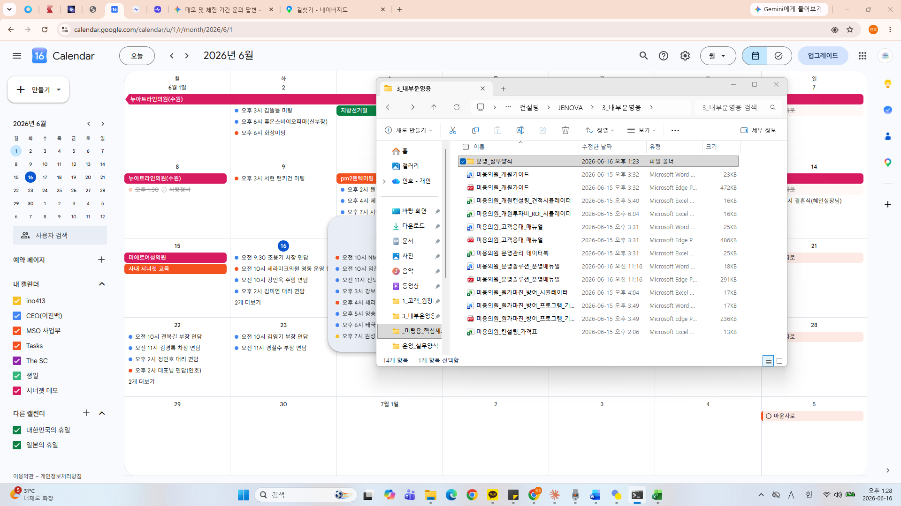

# 작업 기록 — 2026-06-16 13:28

## 작업 요약
- 안건 코멘트 날짜 표시 버그 수정: '방금 전' 고정 텍스트 → 실제 등록 날짜/시간 표기로 변경
- 기존 DB에 저장된 '방금 전' 코멘트 일괄 마이그레이션 함수 추가 (최초 1회 자동 실행)
  - cid 있는 코멘트: Date.now() 기반 cid에서 실제 등록 시각 역산
  - cid 없는 초기 등록 이벤트: Supabase created_at 컬럼으로 케이스 생성 시각 사용

## 생성 / 수정된 파일
- `index.html` — _mrNow() 헬퍼 추가, mrPostComment/안건등록 3곳 time 교체, mrMigrateCommentTimes() 추가, initMsoReport()에 마이그레이션 호출

## 스크린샷

